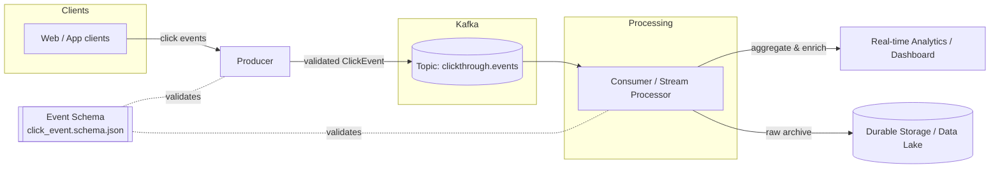

# Kafka ClickThrough Stream

A streaming pipeline that ingests click-through events, publishes them to Kafka, and processes the stream for real-time analytics.

## What we're building

The goal is a production-shaped, end-to-end clickstream pipeline that demonstrates how user click-through events flow from the browser all the way to real-time dashboards and durable storage. Concretely, we aim to:

- **Capture click-through events** — every meaningful click (ads, links, CTAs) is turned into a structured `ClickEvent` and published to Kafka.
- **Decouple producers from consumers** — Kafka acts as the durable buffer so ingestion and processing scale independently and tolerate spikes.
- **Process the stream in real time** — enrich, filter, and aggregate events (e.g. click counts per URL, per session, per time window).
- **Fan out to multiple sinks** — push results to a real-time analytics store/dashboard and archive raw events to durable storage for replay and batch analysis.
- **Guarantee data quality** — enforce a shared event schema so producers and consumers never drift.
- **Stay observable & reproducible** — a one-command local Kafka stack, config-driven topics/brokers, and tests around the core paths.

## Architecture



**Flow:** clients emit clicks → the **producer** validates each event against the shared schema and publishes to the `clickthrough.events` topic → **Kafka** durably buffers the stream → the **consumer/stream processor** reads, enriches, and aggregates → results fan out to a **real-time analytics/dashboard** sink while raw events are archived to **durable storage** for replay and batch analysis.

## Layout

| Path | Purpose |
|------|---------|
| `src/producer/` | Emits click-through events to Kafka |
| `src/consumer/` | Reads and processes the clickstream |
| `src/schemas/`  | Event schemas (Avro/JSON) |
| `config/`       | Broker, topic, and app configuration |
| `docker/`       | Local Kafka + Zookeeper stack |
| `tests/`        | Unit and integration tests |

## Getting started

```bash
# 1. Start a local Kafka cluster
docker compose -f docker/docker-compose.yml up -d

# 2. Install dependencies
# (fill in once a language/runtime is chosen)

# 3. Run the producer and consumer
```

## Configuration

See [config/app.example.yaml](config/app.example.yaml). Copy it to `config/app.yaml` and adjust broker addresses and topic names.
