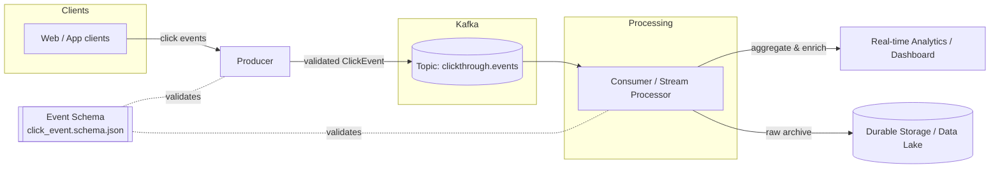
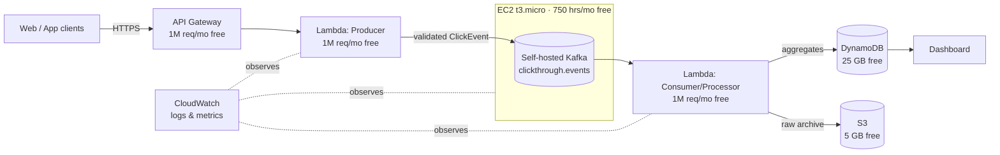

# Kafka ClickThrough Stream

A streaming pipeline that ingests click-through events, publishes them to Kafka, and processes the stream for real-time analytics.

## What we're building

The goal is a production-shaped, end-to-end clickstream pipeline that demonstrates how user click-through events flow from the browser all the way to real-time dashboards and durable storage. Concretely, we aim to:

- **Capture click-through events** — every meaningful click (ads, links, CTAs) is turned into a structured `ClickEvent` and published to Kafka.
- **Decouple producers from consumers** — Kafka acts as the durable buffer so ingestion and processing scale independently and tolerate spikes.
- **Process the stream in real time** — enrich, filter, and aggregate events (e.g. click counts per URL, per session, per time window).
- **Fan out to multiple sinks** — push results to a real-time analytics store/dashboard and archive raw events to durable storage for replay and batch analysis.
- **Guarantee data quality** — enforce a shared event schema so producers and consumers never drift.
- **Stay observable & reproducible** — a one-command local Kafka stack, config-driven topics/brokers, and tests around the core paths.

## Architecture



**Flow:** clients emit clicks → the **producer** validates each event against the shared schema and publishes to the `clickthrough.events` topic → **Kafka** durably buffers the stream → the **consumer/stream processor** reads, enriches, and aggregates → results fan out to a **real-time analytics/dashboard** sink while raw events are archived to **durable storage** for replay and batch analysis.

## AWS Free-Tier Deployment

We deploy this entirely on the **AWS Free Tier**. Note that **Amazon MSK has no free tier**, so we self-host Kafka on an EC2 micro instance rather than using a managed broker.



### Service mapping

| Component | AWS Service | Free-tier allowance |
|-----------|-------------|---------------------|
| Ingestion endpoint | **API Gateway** (HTTP API) | 1M requests / month |
| Producer | **AWS Lambda** | 1M requests + 400k GB-s / month |
| Kafka broker | **EC2 `t3.micro`** (self-hosted Kafka) | 750 hrs / month (12 months) |
| Consumer / stream processor | **AWS Lambda** | shares the Lambda free tier |
| Real-time aggregates store | **DynamoDB** | 25 GB storage + 25 RCU/WCU |
| Raw event archive / data lake | **Amazon S3** | 5 GB standard storage |
| Logs, metrics, alarms | **CloudWatch** | 10 metrics, 5 GB logs, 10 alarms |

> **Free-tier watch-outs:** a single `t3.micro` Kafka node is fine for a demo but has no HA — keep replication factor at 1 and topics small. EBS storage for the EC2 volume (30 GB free) and data-transfer limits are the usual first costs to exceed, so set a **billing alarm** in CloudWatch before you start.

## Layout

The core producer and consumer are written in **Go** (using [`segmentio/kafka-go`](https://github.com/segmentio/kafka-go), a pure-Go client — no C/librdkafka dependency).

| Path | Purpose |
|------|---------|
| `cmd/producer/`   | Emits click-through events to Kafka |
| `cmd/consumer/`   | Reads the clickstream and maintains real-time aggregates |
| `internal/event/` | Shared `ClickEvent` type + validation (mirrors the JSON schema) |
| `internal/kafka/` | Broker/topic config from environment |
| `src/schemas/`    | Event schema (JSON) |
| `config/`         | Example broker/topic configuration |
| `docker/`         | Local Kafka + Zookeeper stack |

## Getting started

Requires **Go 1.21+** and **Docker**.

```bash
# 1. Start a local Kafka cluster
make kafka-up

# 2. In one terminal, run the consumer
make consumer

# 3. In another terminal, run the producer
make producer

# Events now flow: producer → Kafka → consumer prints live aggregates.
# Stop the cluster when done:
make kafka-down
```

Override defaults via env vars: `KAFKA_BROKER`, `KAFKA_TOPIC`, `KAFKA_GROUP_ID`.

## Configuration

See [config/app.example.yaml](config/app.example.yaml). Copy it to `config/app.yaml` and adjust broker addresses and topic names.
